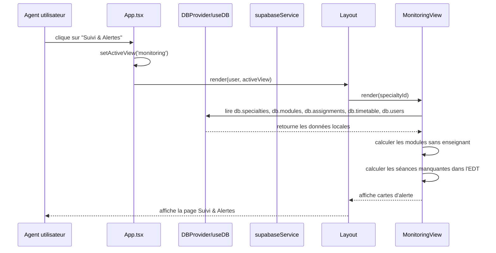
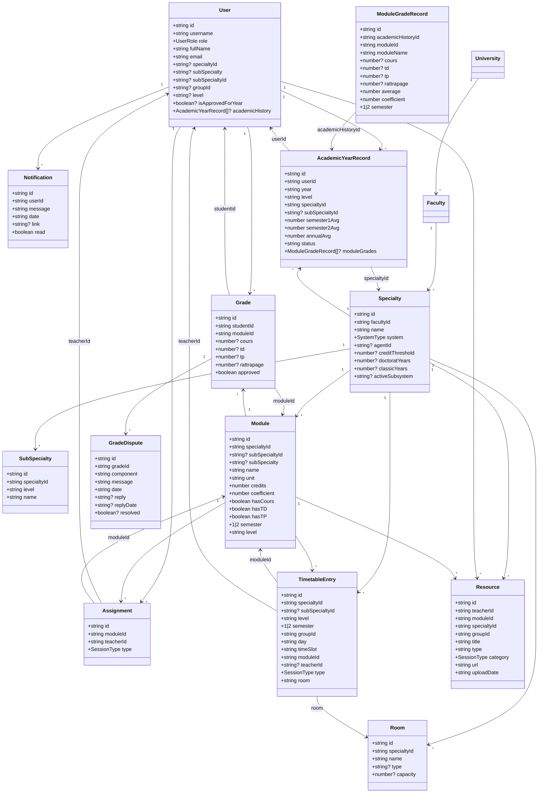

# EduQuest - Diagrams

Ce document décrit la logique principale de l'application `EduQuest` dans le dossier `PFEv3`.

## 1. Diagramme de cas d'utilisation (Use Case)

```mermaid
%%{init: { 'theme': 'base', 'themeVariables': { 'primaryColor': '#8b5cf6', 'secondaryColor': '#f97316', 'tertiaryColor': '#10b981', 'lineColor': '#374151', 'textColor': '#111827' } }}%%
usecaseDiagram
  actor Admin
  actor Agent
  actor Teacher
  actor Student

  Admin --> (Se connecter)
  Admin --> (Gérer les universités)
  Admin --> (Gérer les spécialités)
  Admin --> (Gérer les utilisateurs)
  Admin --> (Voir le tableau de bord)

  Agent --> (Se connecter)
  Agent --> (Voir Suivi & Alertes)
  Agent --> (Gérer les modules)
  Agent --> (Assigner des enseignants)
  Agent --> (Gérer l'emploi du temps)
  Agent --> (Gérer les étudiants)
  Agent --> (Valider inscriptions / notes)

  Teacher --> (Se connecter)
  Teacher --> (Voir planning)
  Teacher --> (Saisir notes)
  Teacher --> (Partager ressources)

  Student --> (Se connecter)
  Student --> (Voir tableau de bord)
  Student --> (Voir emploi du temps)
  Student --> (Voir notes)
  Student --> (Consulter ressources)

  (Se connecter) ..> (Voir Suivi & Alertes) : authentification
  (Gérer les étudiants) ..> (Valider inscriptions / notes) : supervision
```

## 2. Diagramme de séquence - Agent ouvre Suivi & Alertes



## 3. Diagramme de classes du domaine



## Notes
- La logique centrale est gérée par `App.tsx`, qui route les vues selon le rôle (`UserRole`) et `activeView`.
- `DBProvider` charge les données de Supabase et les expose via `useDB()`.
- `MonitoringView` est responsable du calcul des alertes `Manque d'Enseignants` et `Manque dans l'EDT`.
- Les types sont définis dans `types.ts`, ce qui constitue le modèle de données principal de l'application.
